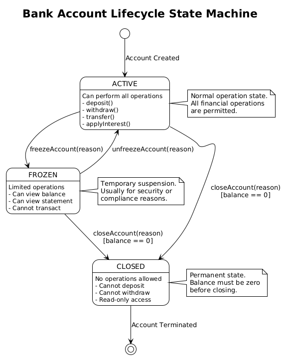
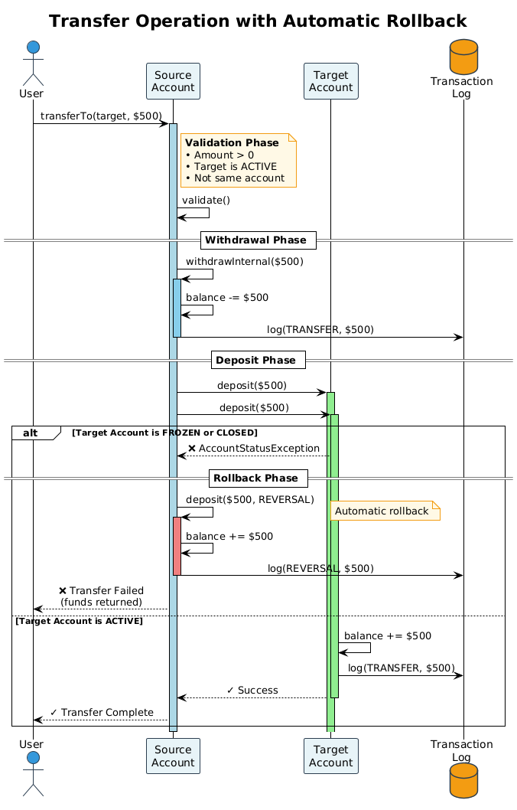

# Bank Account Management System

A comprehensive Java banking system demonstrating OOP principles, design patterns, and software engineering best practices.

## 📋 Table of Contents

- [Overview](#overview)
- [Features](#features)
- [Architecture](#architecture)
- [Getting Started](#getting-started)
- [Usage Examples](#usage-examples)
- [API Reference](#api-reference)
- [Design Patterns](#design-patterns)
- [Exception Handling](#exception-handling)
- [Testing](#testing)
- [Requirements](#requirements)

## 🎯 Overview

A Java 11+ banking system with account management, transaction processing, user authentication, and data persistence. Features thread-safe operations, immutable transaction records, extensible design, and automated background services.

## ✨ Features

- **Account Types**: Checking (overdraft protection) and Savings (interest-earning)
- **Operations**: Deposits, withdrawals, transfers with automatic rollback on failure
- **Status Management**: Active, Frozen, and Closed account states
- **User System**: Registration and authentication with password validation
- **Data Persistence**: Java serialization (data/bank.dat) for session recovery
- **Automated Interest**: Background service applies interest every 10 seconds
- **Transaction Logging**: Immutable audit trail with type filtering
- **Thread Safety**: ConcurrentHashMap for concurrent operations

### Checking Account
- Configurable overdraft limit (default $500)
- $35 flat fee when entering overdraft
- No minimum balance requirement

### Savings Account
- No overdraft (balance must stay positive)
- Configurable interest rate (default 2%)
- Interest compounds on principal

## 🏗️ Architecture

### Package Structure

```
banking/
├── Bank.java                     # Account/user registry
├── CentralBank.java              # Singleton for global rates
├── accounts/
│   ├── BankAccount.java          # Abstract base class
│   ├── CheckingAccount.java     # Overdraft implementation
│   ├── SavingsAccount.java      # Interest implementation
│   ├── User.java                 # Authentication model
│   └── AccountStatus.java        # ACTIVE/FROZEN/CLOSED enum
├── transactions/
│   ├── Transaction.java          # Immutable transaction record
│   └── TransactionType.java     # Type enum
└── exceptions/                   # Custom exception types

app/
└── BankApp.java                  # Demo application
```

### Class Diagram


**Key Relationships:**
- CheckingAccount & SavingsAccount extend BankAccount
- Bank manages BankAccount and User instances
- User links to BankAccount via account ID
- BankAccount contains Transaction list

### Account Lifecycle



**State Transitions:**
- **ACTIVE** → **FROZEN**: `freeze()` - Suspends operations
- **FROZEN** → **ACTIVE**: `unfreeze()` - Restores operations
- **ACTIVE/FROZEN** → **CLOSED**: `close()` - Permanent closure (requires $0 balance)

### Transfer Logic with Rollback



**Two-Phase Commit:**
1. **Withdrawal Phase**: Deduct from source account
2. **Deposit Phase**: Add to target account
3. **Rollback**: If deposit fails, automatically reverse withdrawal

## 🚀 Getting Started

### Prerequisites

- **Java 11+** (uses var, List.of(), LocalDateTime)
- **JUnit 5** and **Google Truth** (for testing)
- **PlantUML** (optional, for diagram generation)

### Installation

```bash
# Clone repository
git clone https://github.com/OmarElmelegy/Bank-OS_Java.git
cd Bank-OS_Java

# Compile source code
javac -d bin -cp "lib/*:." src/banking/**/*.java src/banking/*.java src/app/*.java

# Run application
java -cp bin app.BankApp

# Run tests
java -cp "lib/*:bin" org.junit.platform.console.ConsoleLauncher --scan-class-path
```


## 🚀 Getting Started

### Prerequisites
- Java 11 or higher
- JUnit 5 (included in `lib/`)
- Google Truth library (included in `lib/`)

### Quick Start

```bash
# Compile
javac -d bin src/app/*.java src/banking/**/*.java

# Run
java -cp bin app.BankApp

# Test
java -cp "lib/*:bin" org.junit.platform.console.ConsoleLauncher --scan-class-path
```

## 💡 Usage Examples

### Creating and Managing Accounts

```java
Bank bank = new Bank();

// Create accounts
CheckingAccount checking = new CheckingAccount("C001", "Alice", 1000.0);
SavingsAccount savings = new SavingsAccount("S001", "Bob", 5000.0);

bank.registerAccount(checking);
bank.registerAccount(savings);

// Basic operations
checking.deposit(500.0);      // Balance: $1500
checking.withdraw(200.0);     // Balance: $1300
checking.transfer(savings, 300.0);  // Checking: $1000, Savings: $5300
```

### Overdraft Protection

```java
CheckingAccount account = new CheckingAccount("C001", "Alice", 100.0);
account.setOverdraftLimit(500.0);

account.withdraw(400.0);  // Balance: -$300 (overdraft)
                          // $35 fee applied: -$335
```

### Account Status Management

```java
BankAccount account = bank.findAccount("C001");

account.freeze();     // Prevents operations
account.unfreeze();   // Re-enables operations
account.close();      // Permanent closure
```

### User Authentication

```java
// Register
String accountId = bank.createNewCustomer("alice", "secure123");

// Login
User user = bank.authenticateUser("alice", "secure123");
BankAccount account = bank.findAccount(user.getAccountId());
```

### Interest Application

```java
SavingsAccount savings = new SavingsAccount("S001", "Bob", 1000.0);
savings.setInterestRate(0.05);  // 5%

savings.applyInterest();  // Adds $50
```

## 📚 API Reference

### Core Classes

| Class | Key Methods | Description |
|-------|-------------|-------------|
| **Bank** | `registerAccount()`, `findAccount()`, `createNewCustomer()`, `authenticateUser()` | Account and user registry |
| **BankAccount** | `deposit()`, `withdraw()`, `transfer()`, `getBalance()`, `freeze()`, `close()` | Abstract account base |
| **CheckingAccount** | `setOverdraftLimit()`, `isInOverdraft()` | Overdraft protection |
| **SavingsAccount** | `setInterestRate()`, `applyInterest()` | Interest-earning account |
| **User** | `getUsername()`, `getAccountId()`, `validatePassword()` | Authentication model |
| **Transaction** | `getAmount()`, `getType()`, `getTimestamp()` | Immutable transaction record |
| **CentralBank** | `getInstance()`, `getInterestRate()`, `setInterestRate()` | Global rate singleton |

### Exception Hierarchy

| Exception | Trigger Condition |
|-----------|------------------|
| `InvalidAmountException` | Amount ≤ 0 or NaN |
| `InsufficientFundsException` | Balance insufficient for withdrawal |
| `AccountStatusException` | Operation on FROZEN/CLOSED account |
| `UserStatusException` | Invalid user state |
| `InvalidCredentialsException` | Authentication failure |

## 🎨 Design Patterns

### Template Method
`BankAccount.withdraw()` defines algorithm, subclasses override `withdrawInternal()` for overdraft/interest logic.

### Singleton
`CentralBank.getInstance()` ensures one global rate manager.

### Factory Method
`Bank.createNewCustomer()` encapsulates account+user creation logic.

The abstract base class defines the skeleton of withdrawal operations, allowing subclasses to customize specific steps:

```java


```java
// BankAccount.withdraw() - template method
public void withdraw(double amount) throws Exception {
    withdrawInternal(amount, TransactionType.WITHDRAWAL);
}

// Subclasses override withdrawInternal()
// CheckingAccount: overdraft + fee logic
// SavingsAccount: no overdraft allowed
```

### Exception Handling

**Custom Exceptions:**
- `InvalidAmountException` - Amount ≤ 0
- `InsufficientFundsException` - Balance too low
- `AccountStatusException` - Operation on FROZEN/CLOSED account
- `UserStatusException` - Invalid user state
- `InvalidCredentialsException` - Authentication failure

**Transfer Rollback:**
```java
// Two-phase commit with automatic rollback
try {
    withdrawInternal(amount, TransactionType.TRANSFER);
    target.deposit(amount);
} catch (Exception e) {
    deposit(amount, TransactionType.REVERSAL);  // Rollback
    throw new RuntimeException("Transfer failed, funds returned", e);
}
```

## 🧪 Testing

**53 tests (100% passing):**

| Test File | Tests | Coverage |
|-----------|-------|----------|
| CheckingAccountTest | 5 | Overdraft limits, fees |
| SavingsAccountTest | 6 | Interest rates |
| AccountTransactionTest | 14 | Deposits, withdrawals, transfers |
| AccountLifecycleTest | 10 | Freeze, unfreeze, close |
| TransactionTest | 8 | Immutability, filtering |
| UserAuthenticationTest | 10 | Registration, login |

```bash
# Run all tests
java -cp "lib/*:bin" org.junit.platform.console.ConsoleLauncher --scan-class-path
```

## 📁 Project Structure

```
BankSystem/
├── src/banking/           # Core domain
│   ├── accounts/          # Account models
│   ├── transactions/      # Transaction tracking
│   └── exceptions/        # Custom exceptions
│   └── app/
│       └── BankApp.java                  # Demo application
├── tests/
│   ├── CheckingAccountTest.java
│   ├── SavingsAccountTest.java
│   ├── AccountTransactionTest.java
│   ├── AccountLifecycleTest.java
├── tests/                 # JUnit 5 tests
├── lib/                   # Dependencies
├── data/                  # Persistent data
│   └── bank.dat          # Serialized accounts/users
├── docs/                  # Documentation
│   ├── class-diagram.png
│   └── api/              # Javadoc HTML
├── out/docs/             # Generated diagrams
└── bin/                   # Compiled classes
```

## 📖 Documentation

- **Javadoc**: [docs/api/index.html](docs/api/index.html)
- **Class Diagram**: [docs/class-diagram.png](docs/class-diagram.png)
- **Source**: [docs/class-diagram.puml](docs/class-diagram.puml)

## 🔧 Requirements

- **Java 11+** (LocalDateTime, var, Optional)
- **JUnit 5** (Jupiter 5.10.1+)
- **Google Truth** (1.1.5+)

---

## Future Work

- **We take this exact Bank Engine and replace the black console with Windows, Buttons, and Charts. You will learn Event-Driven Programming.**
