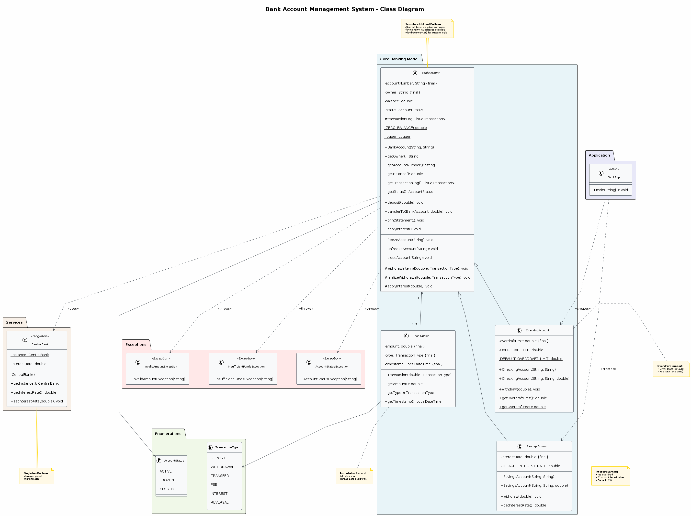
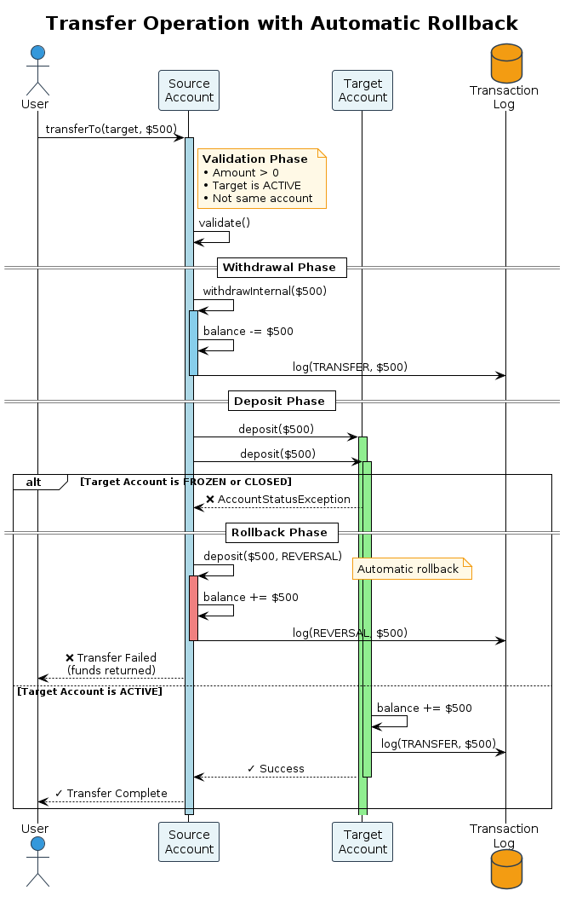
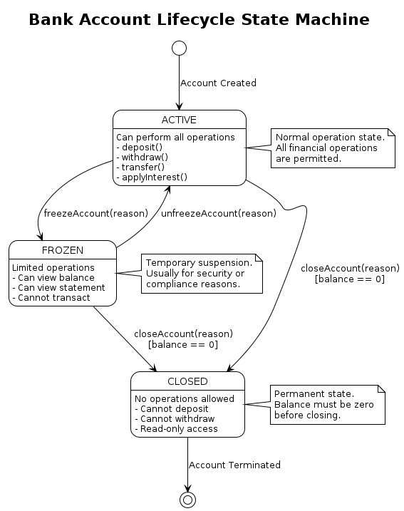

# Bank Account Management System

A robust, object-oriented banking system implemented in Java, demonstrating key software engineering principles including inheritance, polymorphism, exception handling, and design patterns.

## 📋 Table of Contents

- [Overview](#overview)
- [Features](#features)
- [Architecture](#architecture)
- [Class Diagram](#class-diagram)
- [Getting Started](#getting-started)
- [Usage Examples](#usage-examples)
- [API Documentation](#api-documentation)
- [Design Patterns](#design-patterns)
- [Exception Handling](#exception-handling)
- [Testing](#testing)
- [Project Structure](#project-structure)
- [Requirements](#requirements)
- [License](#license)

## 🎯 Overview

The Bank Account Management System is a Java-based application that simulates real-world banking operations. It provides a flexible framework for managing different types of bank accounts with features like deposits, withdrawals, transfers, and interest calculations.

### Key Highlights

- **Type Safety**: Strongly typed with comprehensive validation
- **Thread Safety**: Synchronized operations for concurrent access
- **Immutability**: Transaction records are immutable for audit integrity
- **Extensibility**: Abstract base class design allows easy addition of new account types
- **Logging**: Built-in logging framework for audit trails
- **Exception Safety**: Comprehensive exception handling with rollback mechanisms

## ✨ Features

### Account Management
- ✅ Multiple account types (Checking, Savings)
- ✅ Account status management (Active, Frozen, Closed)
- ✅ Unique account identification
- ✅ Owner information tracking
- ✅ **Persistent Storage**: Account data saved to disk using Java serialization
- ✅ **Automatic Account Recovery**: Load existing accounts from previous sessions
- ✅ **User Authentication**: Secure login with username/password
- ✅ **User Registration**: Create new customers with linked accounts

### Financial Operations
- ✅ **Deposits**: Add funds with validation
- ✅ **Withdrawals**: Remove funds with balance checks
- ✅ **Transfers**: Move money between accounts with rollback on failure
- ✅ **Interest Application**: Automatic interest calculation and application
- ✅ **Scheduled Interest Service**: Background thread applies interest every 10 seconds (simulating nightly batches)

### Account Types

#### Checking Account
- Overdraft protection up to configurable limit
- Flat fee ($35) charged when entering overdraft
- No minimum balance requirement
- Suitable for frequent transactions

#### Savings Account
- No overdraft protection (balance must stay positive)
- Configurable interest rate (0-10%)
- Interest-earning capability
- Suitable for saving money

### Transaction Management
- Complete transaction history logging
- Immutable transaction records
- Transaction type categorization (DEPOSIT, WITHDRAWAL, TRANSFER, FEE, INTEREST, REVERSAL)
- Timestamp tracking
- Filter transactions by type
- Transaction logs persisted with account data

### Security & Validation
- Account freeze/unfreeze capability
- Account closure with balance verification
- Null-safety with Objects.requireNonNull()
- Amount validation (positive values only)
- Status checks before operations

### Bank Management
- ✅ **Multi-account Management**: Bank class manages multiple accounts with thread-safe operations
- ✅ **User Management**: Register users and authenticate credentials
- ✅ **Data Persistence**: Save and load all accounts and users to/from disk (bank.dat)
- ✅ **Interest Service**: Automated scheduled interest application to all savings accounts
- ✅ **Account Registry**: Prevent duplicate accounts, retrieve accounts by ID
- ✅ **Graceful Shutdown**: Proper cleanup of background services

## 🏗️ Architecture

The system follows a **layered architecture** with clear separation of concerns:

```
┌─────────────────────────────────────┐
│     Presentation Layer              │
│  (BankApp - Demo Application)       │
└──────────────┬──────────────────────┘
               │
┌──────────────▼──────────────────────┐
│     Business Logic Layer            │
│  (Account Operations & Validation)  │
│  - BankAccount (Abstract)           │
│  - CheckingAccount                  │
│  - SavingsAccount                   │
│  - CentralBank (Singleton)          │
└──────────────┬──────────────────────┘
               │
┌──────────────▼──────────────────────┐
│     Data Layer                      │
│  (Transaction Records & Enums)      │
│  - Transaction                      │
│  - TransactionType                  │
│  - AccountStatus                    │
└──────────────┬──────────────────────┘
               │
┌──────────────▼──────────────────────┐
│     Exception Layer                 │
│  - InvalidAmountException           │
│  - InsufficientFundsException       │
│  - UserStatusException              │
│  - InvalidCredentialsException      │
│  - AccountStatusException           │
└─────────────────────────────────────┘
```

### Design Principles Applied

1. **SOLID Principles**
   - **Single Responsibility**: Each class has one clear purpose
   - **Open/Closed**: Open for extension (new account types), closed for modification
   - **Liskov Substitution**: Subclasses can replace BankAccount transparently
   - **Interface Segregation**: Focused interfaces without bloat
   - **Dependency Inversion**: Depends on abstractions (BankAccount)

2. **DRY (Don't Repeat Yourself)**
   - Common functionality in abstract base class
   - Shared validation logic

3. **Fail-Fast**
   - Early validation before state changes
   - Immediate exception throwing on invalid input

## 📊 Class Diagram



*Figure 1: Complete system class diagram showing all relationships and design patterns*

See [`docs/class-diagram.puml`](docs/class-diagram.puml) for the PlantUML source.
` manages multiple `BankAccount` and `User` instances
- `User` links to a `BankAccount` via account ID
- `Bank
### Key Relationships
- `CheckingAccount` and `SavingsAccount` extend `BankAccount`
- `BankAccount` uses `Transaction` for logging
- `Transaction` uses `TransactionType` enum
- `BankAccount` uses `AccountStatus` enum
- `CentralBank` is a singleton managing global interest rates

### Additional Diagrams

#### Transfer Operation Flow


*Figure 2: Transfer operation with rollback mechanism*

#### Account Lifecycle


*Figure 3: Account status state machine (ACTIVE → FROZEN → CLOSED)*

> **Note:** To generate diagram images from PlantUML source files, use:
> ```bash
> # Generate all diagrams as PNG images
> plantuml docs/*.puml -o ../out/docs
> 
> # Or use VS Code PlantUML extension:
> # 1. Install "PlantUML" extension
> # 2. Right-click on .puml file → "Export Current Diagram"
> # 3. Choose PNG format and save to out/docs/
> ```

## 🚀 Getting Started

### Prerequisites

- Java 11 or higher
- JUnit 5 (for testing)
- Google Truth library (for assertions in tests)
- Maven or Gradle (optional, for dependency management)

### Installation

1. **Clone the repository**
   ```bash
   git clone https://github.com/OmarElmelegy/Bank-OS_Java.git
   cd Bank-OS_Java
   ```

2. **Compile the project**
   ```bash
   javac *.java
   ```

3. **Run the demo application**
   ```bash
   java BankApp
### Quick Start Example

```java
// Create bank and load saved data
Bank myBank = new Bank();
myBank.loadData();

// Create accounts
CheckingAccount checking = new CheckingAccount("CHK001", "John Doe", 500.0);
SavingsAccount savings = new SavingsAccount("SAV001", "Jane Smith", 0.03);

// Register accounts
myBank.openAccount(checking);
myBank.openAccount(savings);

// Start automated interest service
myBank.startInterestService();

// Deposit money
checking.deposit(1000.0);
savings.deposit(5000.0);

// Withdraw money
checking.withdraw(200.0);

// Transfer between accounts
checking.transferTo(savings, 300.0);

// Apply interest manually
savings.applyInterest();

// Print statements
checking.printStatement();
savings.printStatement();

// Save data and cleanup
myBank.stopServices();
myBank.saveData();
```cking.transferTo(savings, 300.0);

// Apply interest
savings.applyInterest();

// Print statements
checking.printStatement();
savings.printStatement();
```

## 💡 Usage Examples

### Creating Accounts

```java
// Checking account with default overdraft ($500)
CheckingAccount checking = new CheckingAccount("CHK001", "Alice");

// Checking account with custom overdraft
CheckingAccount premium = new CheckingAccount("CHK002", "Bob", 1000.0);

// Savings account with default interest rate (2%)
SavingsAccount savings = new SavingsAccount("SAV001", "Charlie");

// Savings account with custom interest rate (3.5%)
SavingsAccount highYield = new SavingsAccount("SAV002", "Diana", 0.035);
```

### Deposits and Withdrawals

```java
try {
    // Deposit
    account.deposit(500.0);
    
    // Withdraw
    account.withdraw(100.0);
    
} catch (InvalidAmountException e) {
    System.err.println("Invalid amount: " + e.getMessage());
} catch (InsufficientFundsException e) {
    System.err.println("Not enough funds: " + e.getMessage());
} catch (AccountStatusException e) {
    System.err.println("Account issue: " + e.getMessage());
}
```

### Overdraft Protection (Checking Only)

```java
CheckingAccount checking = new CheckingAccount("CHK001", "User", 500.0);
checking.deposit(100.0);  // Balance: $100

// Withdraw more than balance but within overdraft
checking.withdraw(400.0);  // Balance: -$300, Fee: $35 charged
// Final balance: -$335
```

### Transfers with Rollback

```java
try {
    sourceAccount.transferTo(targetAccount, 1000.0);
    System.out.println("Transfer successful!");
} catch (Exception e) {
    // If transfer fails, amount is automatically returned to source
    System.err.println("Transfer failed: " + e.getMessage());
}
```

### Account Status Management

```java
// Freeze account
account.freezeAccount("Suspicious activity detected");

// Try to withdraw (will fail)
try {
    account.withdraw(100.0);
} catch (AccountStatusException e) {
    System.out.println("Operation blocked: " + e.getMessage());
}

// Unfreeze account
account.unfreezeAccount("Verification completed");

// Close account (balance must be zero)
account.closeAccount("Customer request");
```

### Transaction History

```java
// Get all transactions
List<Transaction> allTransactions = account.getTransactionLog();

// Filter by type
List<Transaction> deposits = account.getTransactionByType(TransactionType.DEPOSIT);
List<Transaction> withdrawals = account.getTransactionByType(TransactionType.WITHDRAWAL);
List<Transaction> fees = account.getTransactionByType(TransactionType.FEE);

// Print statement
### Central Bank Rate Management

```java
CentralBank centralBank = CentralBank.getInstance();

// Get current rate
double rate = centralBank.getInterestRate();

// Update rate (affects checking accounts)
centralBank.setInterestRate(0.03); // 3%
```

### Bank Operations

```java
// Create and initialize bank
Bank myBank = new Bank();

// Load saved accounts from previous session
myBank.loadData();

// Open new account
### Core Classes

#### Bank
- `openAccount(BankAccount account)` - Register a new account
- `getAccount(String id)` - Retrieand users to disk (bank.dat)
- `loadData()` - Load accounts and users from disk
- `createNewCustomer(String, String, String, String)` - Register new user with account
- `authenticateUser(String, String)` - Validate user credentials to all savings accounts
- `startInterestService()` - Start automated interest scheduler
- `stopServices()` - Stop background services
- `saveData()` - Persist accounts to disk (bank.dat)
- `loadData()` - Load accounts from disk

#### BankAccount (Abstract)
- `deposit(double amount)` - Add funds
- `withdraw(double amount)` - Remove funds (implemented by subclasses)
- `transferTo(BankAccount target, double amount)` - Transfer money
- `applyInterest()` - Apply interest
- `getBalance()` - Get current balance
- `getTransactionLog()` - Get transaction history
- `printStatement()` - Print account statement
- `freezeAccount(String reason)` - Freeze the account
- `unfreezeAccount(String reason)` - Unfreeze the account
- `closeAccount(String reason)` - Close the account permanently

#### CheckingAccount
- Constructor: `CheckingAccount(String id, String owner, double overdraftLimit)`
- `getOverdraftLimit()` - Get overdraft limit
- `getOverdraftFee()` - Get fee amount (static)

#### SavingsAccount
- Constructor: `SavingsAccount(String id, String owner, double interestRate)`
- `getInterestRate()` - Get account interest rate

#### Transaction
- `getAmount()` - Get transaction amount
- `getType()` - Get transaction type
- `getTimestamp()` - Get transaction time

#### AccountStatus (Enum)
- `ACTIVE` - Account is operational
- `FROZEN` - Account is temporarily blocked

#### User
- `getUsername()` - Get username
- `getPassword()` - Get password
- `getLinkedAccountId()` - Get associated account ID
- `CLOSED` - Account is permanently closed

#### CentralBank (Singleton)
- `getInstance()` - Get singleton instance
- `getInterestRate()` - Get default interest rate
- `setInterestRate(double rate)` - Set default interest rate

// Stop background services
myBank.stopServices();
```

### Data Persistence

```java
Bank myBank = new Bank();

// Load saved data from disk (bank.dat)
myBank.loadData(); // Silently returns if file doesn't exist

// ... perform operations ...

// Save all account data to disk
myBank.saveData(); // Creates/overwrites bank.dat
```ingsAccount highYield = new SavingsAccount("SAV001", "User", 0.05);
highYield.deposit(10000.0);
highYield.applyInterest(); // Uses 5% instead of central bank rate
```

### Central Bank Rate Management

```java
CentralBank centralBank = CentralBank.getInstance();

// Get current rate
double rate = centralBank.getInterestRate();

// Update rate (affects checking accounts)
centralBank.setInterestRate(0.03); // 3%
```

## 📚 API Documentation

Full API documentation is available in JavaDoc format. Generate it using:

```bash
javadoc -d docs/api -sourcepath . -subpackages .
```

Or view the pre-generated documentation in [`docs/index.html`](docs/index.html).

### Core Classes

#### BankAccount (Abstract)
- `deposit(double amount)` - Add funds
- `withdraw(double amount)` - Remove funds (implemented by subclasses)
- `transferTo(BankAccount target, double amount)` - Transfer money
- `applyInterest()` - Apply interest
- `getBalance()` - Get current balance
- `getTransactionLog()` - Get transaction history
- `printStatement()` - Print account statement

#### CheckingAccount
- Constructor: `CheckingAccount(String id, String owner, double overdraftLimit)`
- `getOverdraftLimit()` - Get overdraft limit
- `getOverdraftFee()` - Get fee amount (static)

#### SavingsAccount
- Constructor: `SavingsAccount(String id, String owner, double interestRate)`
- `getInterestRate()` - Get account interest rate

#### Transaction
- `getAmount()` - Get transaction amount
- `getType()` - Get transaction type
- `getTimestamp()` - Get transaction time

## 🎨 Design Patterns

### 1. Template Method Pattern
**Location**: `BankAccount.withdrawInternal()`

The abstract base class defines the skeleton of withdrawal operations:
- Validate account status
- Validate amount
- Delegate to subclass for specific rules
- Finalize withdrawal with `finalizeWithdrawal()`

```java
// In BankAccount
protected synchronized void withdrawInternal(double amount, TransactionType type) {
    // Common validation
    validateStatus();
    validateAmount(amount);
    // Subclass implements specific logic
}

// In CheckingAccount
@Override
protected void withdrawInternal(double amount, TransactionType type) {
    super.withdrawInternal(amount, type);
    // Check overdraft limit
    // Apply fee if needed
    finalizeWithdrawal(amount, type);
}
```

### 2. Singleton Pattern
**Location**: `CentralBank`

Ensures only one instance manages global interest rates:

```java
public class CentralBank {
    private static CentralBank instance;
    
    private CentralBank() { }
    
    public static synchronized CentralBank getInstance() {
        if (instance == null) {
            instance = new CentralBank();
        }
        return instance;
    }
}
```

### 3. Immutable Object Pattern
**Location**: `Transaction`

Transaction records are immutable for audit integrity:
- All fields are `final`
- No setters provided
- Timestamp set at creation

### 4. Strategy Pattern (Implicit)
Different account types implement different withdrawal strategies:
- **CheckingAccount**: Allow overdraft with fees
- **SavingsAccount**: Strict balance enforcement

## ⚠️ Exception Handling

### Exception Hierarchy

```
Exception
└── RuntimeException
    ├── InvalidAmountException
    ├── InsufficientFundsException
    └── AccountStatusException
```
UserStatusException` | Username already exists during registration |
| | Invalid account type specified |
| `InvalidCredentialsException` | Username doesn't exist during login |
| | Password is incorrect |
| `
### When Exceptions Are Thrown

| Exception | Thrown When |
|-----------|-------------|
| `InvalidAmountException` | Amount ≤ 0 for deposit/withdrawal/transfer |
| `InsufficientFundsException` | Withdrawal exceeds available balance + overdraft |
| `AccountStatusException` | Operation attempted on frozen/closed account |
| | Account opened with duplicate ID |
| | Account retrieved that doesn't exist |
| | Account closed with non-zero balance |
| `IllegalArgumentException` | Invalid constructor arguments (null, empty, negative) |
| `NullPointerException` | Null account number or owner |

### Rollback Mechanism

Transfers use a **two-phase commit** with automatic rollback:

1. **Phase 1**: Withdraw from source
2. **Phase 2**: Deposit to target
3. **On Failure**: Automatically return funds to source with `REVERSAL` transaction

```java
try {
    source.withdrawInternal(amount, TRANSFER);
    target.deposit(amount, TRANSFER);
} catch (Exception e) {
    source.deposit(amount, REVERSAL); // Automatic rollback
    throw new RuntimeException("Transfer failed", e);
}
```

## 🧪 Testing

### Test Coverage

The project includes comprehensive unit tests in [`tests/BankSystemTest.java`](tests/BankSystemTest.java) with **27 test cases** covering all core functionality:

#### Basic Operations (12 tests)
- ✅ Account creation and initialization
- ✅ Deposit operations (positive, negative, zero amounts)
- ✅ Withdrawal operations (sufficient/insufficient funds)
- ✅ Multiple transactions on same account
- ✅ Transaction immutability and correctness
- ✅ Empty account statement generation

#### Account Types (3 tests)
- ✅ Checking account overdraft protection
- ✅ Overdraft fee application ($35 flat fee)
- ✅ Savings account custom interest rates

#### Transfer Operations (2 tests)
- ✅ Successful transfers between accounts
- ✅ Transfer failure with insufficient funds
- ✅ Transfer to frozen account with automatic rollback

#### Account Status Management (6 tests)
- ✅ Account freeze functionality
- ✅ Account unfreeze and status restoration
- ✅ Account closure with zero balance requirement
- ✅ Account closure rejection with non-zero balance
- ✅ Operations blocked on closed accounts
- ✅ Default account status verification (ACTIVE)

#### Transaction Management (2 tests)
- ✅ Transaction log filtering by type
- ✅ Transaction type enum validation

#### Interest Application (2 tests)
- ✅ Interest calculation and application (5% rate)
- ✅ Interest blocked on frozen accounts

### Running Tests

```bash
# Using the provided script
./scripts/run-tests.sh

# Expected output: 27 tests passed
```User.java                     # User authentication model
├── BankAccount.java              # Abstract base class
├── CheckingAccount.java          # Checking account implementation
├── SavingsAccount.java           # Savings account implementation
├── Transaction.java              # Transaction record (immutable)
├── TransactionType.java          # Transaction type enum
├── AccountStatus.java            # Account status enum
├── CentralBank.java              # Singleton for global rates
├── InvalidAmountException.java   # Custom exception
├── InsufficientFundsException.java # Custom exception
├── AccountStatusException.java   # Custom exception
├── UserStatusException.java      # Custom exception
├── InvalidCredentialsException.java
## 📁 Project Structure

```
BankSystem/
├── Bank.java                     # Bank management and persistence
├── BankAccount.java              # Abstract base class
├── CheckingAccount.java          # Checking account implementation
├── SavingsAccount.java           # Savings account implementation
├── Transaction.java              # Transaction record (immutable)
├── TransactionType.java          # Transaction type enum
├── AccountStatus.java            # Account status enum
├── CentralBank.java              # Singleton for global rates
├── InvalidAmountException.java   # Custom exception
├── InsufficientFundsException.java # Custom exception
├── AccountStatusException.java   # Custom exception
├── BankApp.java                  # Interactive demo application
├── bank.dat                      # Serialized account data (created at runtime)
├── bin/                          # Compiled .class files
├── tests/
│   └── BankSystemTest.java       # JUnit test suite
├── lib/                          # External dependencies
│   ├── junit-platform-console-standalone-1.10.1.jar
│   └── truth-1.1.5.jar
├── scripts/
│   └── run-tests.sh              # Test execution script
├── docs/
│   ├── api/                      # JavaDoc HTML documentation
│   │   └── index.html            # JavaDoc entry point
│   ├── class-diagram.puml        # PlantUML class diagram
│   ├── sequence-diagram.puml     # PlantUML sequence diagram
│   ├── overdraft-sequence.puml   # Overdraft flow diagram
│   └── account-lifecycle.puml    # State machine diagram
├── out/
│   └── docs/                     # Generated diagram images
│       ├── class-diagram.png     # Class diagram image
│       ├── sequence-diagram.png  # Transfer sequence image
│       ├── overdraft-sequence.png # Overdraft flow image
│       └── account-lifecycle.png # State machine image
├── README.md                     # This file
└── LICENSE                       # License information
```

## 🔧 Requirements

### Runtime
- **Java**: 11 or higher (uses `var`, `List.of()`, etc.)
- **JVM**: Any standard JVM implementation

### Development
- **IDE**: IntelliJ IDEA, Eclipse, or VS Code recommended
- **Build Tool**: Maven or Gradle (optional)

### Testing
- **JUnit**: 5.x
- **Google Truth**: Latest version
- **Mockito**: Optional for advanced testing

### Dependencies

```xml
<!-- Maven dependencies -->
<dependencies>
    <!-- JUnit 5 -->
    <dependency>
        <groupId>org.junit.jupiter</groupId>
        <artifactId>junit-jupiter</artifactId>
        <version>5.10.1</version>
        <scope>test</scope>
    </dependency>
    
    <!-- Google Truth -->
    <dependency>
        <groupId>com.google.truth</groupId>
        <artifactId>truth</artifactId>
        <version>1.1.5</version>
        <scope>test</scope>
    </dependency>
</dependencies>
```

## 🎓 Learning Objectives

This project demonstrates:

1. **Object-Oriented Programming**
   - Inheritance and polymorphism
   - Encapsulation and data hiding
   - Abstract classes and interfaces

2. **Exception Handling**
   - Custom exceptions
   - Exception propagation
   - Rollback mechanisms

3. **Design Patterns**
   - Singleton pattern
   - Template method pattern
   - Immutable objects
   - Scheduled executor service
   - Serialization for persistence

4. **Best Practices**
   - Input validation
   - Thread safety with ConcurrentHashMap
   - Scheduled background services
   - Data persistence and serialization
   - Logging and auditing
   - Comprehensive documentation
   - Resource cleanup (scheduler shutdown)

5. **Testing**
   - Unit testing with JUnit
   - Assertion libraries
   - Test organization
---

**Made with ❤️ for learning Java and software engineering principles**
